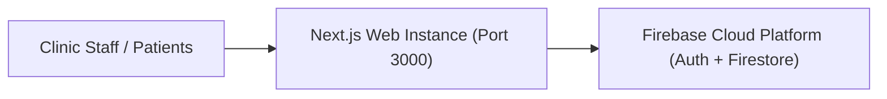
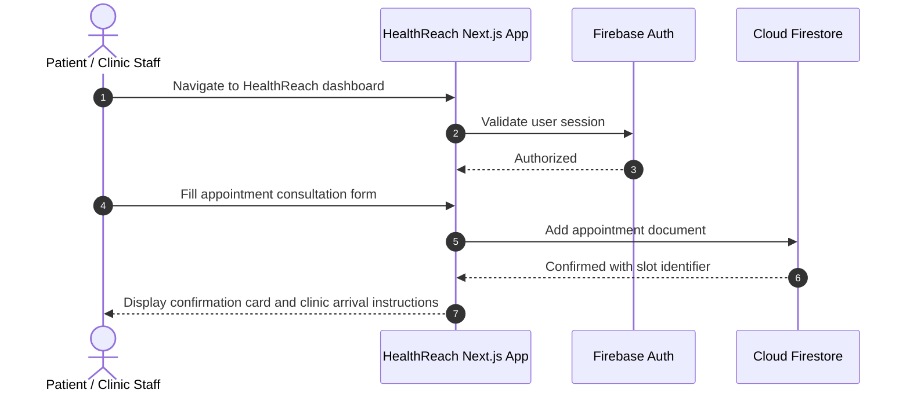

# HealthReach — Clinical Operations Deployment Instance
[]()
[]()
[]()
[]()

## Overview
HealthReach is an optimized deployment distribution of the PulseCare healthcare management platform. Tailored for lightweight cloud instances and continuous hosting, it packages patient triage, appointment dispatch, and clinical department workflows.

- **Problem Solved:** Fast deployment instance of clinical patient scheduling.
- **Target Users:** Healthcare clinics, practitioners, and outpatient centers.
- **Current Status:** Deployed Web Instance.

## Features
- **Patient Triage Dashboard:** Monitor patient waiting queues and urgent consultations.
- **Appointment Calendar:** Real-time scheduling calendar with slot conflict prevention.
- **Firebase Integration:** Secure serverless authentication and real-time database synchronization.

## Architecture


## User Flow


## Technology Stack
| Layer | Technology | Purpose |
|---|---|---|
| Framework | Next.js 15 | React full-stack application framework |
| Language | TypeScript | Static type safety |
| UI | Tailwind CSS, Radix UI | Clinical user interface styling |
| Backend | Firebase Auth & Firestore | Serverless identity and storage |

## Infrastructure
- **Port:** 3000
- **Cloud Platform:** Firebase / Vercel

## Project Structure
```text
health_dep/
├── src/                 # Application source code
├── package.json         # Dependencies
├── .env.example         # Environment template
├── .gitignore           # Git ignore definitions
└── README.md            # Technical documentation
```

## Prerequisites
- Node.js >= 18.x
- Firebase Project

## Environment Variables
Create `.env.local`:
```env
NEXT_PUBLIC_FIREBASE_API_KEY=your_firebase_api_key
NEXT_PUBLIC_FIREBASE_PROJECT_ID=your_firebase_project_id
NEXT_PUBLIC_FIREBASE_APP_ID=your_firebase_app_id
NEXT_PUBLIC_FIREBASE_AUTH_DOMAIN=your_project.firebaseapp.com
NEXT_PUBLIC_FIREBASE_MESSAGING_SENDER_ID=your_sender_id
```

## Local Development Setup
```bash
git clone https://github.com/Bhanutejanallamothu/health_dep.git
cd health_dep
npm install
npm run dev
```

## Docker Setup
*Not detected in repository.*

## Database Setup
Firestore NoSQL database.

## API Documentation
Internal Next.js server actions and API handlers.

## Deployment
```bash
npm run build
```

## Security
- Externalized environment secrets.
- Client authentication state verification.

## Testing
```bash
npm run lint
```

## Troubleshooting
- Check Firebase console to ensure API keys are authorized for hosting domain.

## Future Improvements
- Automated SMS patient reminder triggers.

## License
All rights reserved by repository owner.
